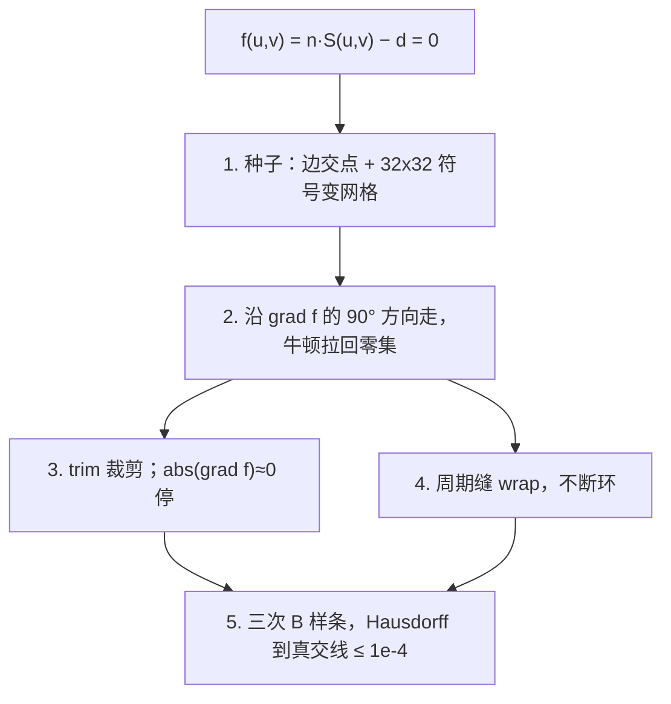

# DESIGN.md — BrepSlicer L0 / L1 / L2

## 目标

直接在 B-rep 上求平面截面，输出类型化曲线段（line / arc / ellipse / cubic B-spline），不先三角化再拟合。
L0 负责拓扑地基；L1 对平面 / 圆柱 / 圆锥 / 球面 / 圆环面给出解析交线；L2 对一般 NURBS 在参数域 marching 并拟合三次 B 样条。求交几何不走 `BRepAlgoAPI_Section`（Section 只出现在 `slice_verify` 的参考周长）。

## 容差策略

不能只用一个数：浮点舍入、几何重合、拓扑缝合是三件不同的事。线容差和角容差量纲不同，必须成对出现，并随 **成型盘尺度、模型最大尺寸、具体数值方法** 一起定。

### 尺度从哪来

记：

| 符号 | 含义 | 本仓库默认所取 |
| --- | --- | --- |
| `B` | 成型盘特征尺寸（打印盘边长 / 直径） | 桌面机 ~ 220 mm |
| `L_max` | 模型 AABB 对角线（假定放得进盘） | `min(bbox diag, B * sqrt(2))`；自检立方体 ~ 17 mm |
| `eps` | IEEE-754 binary64 机器精度 | `2^{-52} ≈ 2.22e-16` |
| `delta_print` | 打印机有效线分辨率（定位/挤出量化，不是喷嘴直径） | ~ 0.01 mm |
| `ulp(L)` | 坐标在尺度 `L` 上的最小可区分增量 | `L * eps`；`L = B = 220` 时 ≈ `5e-14` mm |

打印机决定**上界**：切片几何误差应明显小于 `delta_print`，否则 G-code 量化还没到，轮廓已经糊了。成型盘决定**最坏浮点尺度**：坐标大约在 `[0, B]`，平面偏移 `d = n · p`、叉积、归一化的舍入都随 `L_max` 涨。

线量 `tau_lin` 与角量 `tau_ang` 的换算（盘边缘处的缝隙）：

```
tau_lin  ≈  L_max * tau_ang
tau_ang  ≈  tau_lin / L_max
```

用线容差去判平行，会随模型尺寸漂移；用角容差去拼端点，又没有长度意义。所以每一层都同时给线 / 角两套，由该方法的条件数 `kappa` 放大：

```
tau_arith_lin(method)  =  kappa(method) * L_max * eps
tau_arith_ang(method)  =  kappa(method) * eps
```

`kappa` 不是拍脑袋的同一常数：一次点积 `kappa ~ 4`；法向归一化 `~ 10`；平面–二次曲面闭式解 `~ 1e2`；UV 上牛顿（残差 `f`、`|grad f|` 相除）`~ 1e3–1e4`；高阶配置拟合随控制点数再恶化。

三层必须满足：

```
算术  ≪  几何  ≤  拓扑  ≪  min(delta_print, 薄壁最小间距)
```

### 第一层 ― 算术（arithmetic）

问的是：这次计算在浮点里算不算“已经到头了”，而不是两个 CAD 点是否该缝上。

| 方法 | 线 | 角 | 代码落点 | kappa 量级 |
| --- | --- | --- | --- | --- |
| 平面偏移 `d = n · p`、AABB 投影 | `~ 4 * L_max * eps` | — | 层高比较的下限 | 4 |
| 单位化 / 叉积构造切片标架 | — | `~ 10 * eps` | `makeSliceFrame` | 10 |
| L1 闭式圆心 / 半径 / 点在解析交线上 | 默认 `geom_tolerance = 1e-9` mm（作业下限；对 `L_max ≤ 300` 仍 ≫ `ulp`） | `angular_tolerance` 判轴与平面平行 | `QuadricPlane`、L1 自检 | 1e2 |
| L2 牛顿 `abs(f) → 0` | 残差 ≤ `geom_tolerance`（12 次迭代后再放宽 ×10） | `dot(grad f, grad f) < 1e-18` 视为临界（相对 `abs(S_u)`、`abs(S_v)`） | `UvMarch::newton` | 1e3–1e4 |
| `abs(grad f) ≈ 0` 停步 | 不造长度 | 退化方向不定 | 标 `tangent_point` | — |

作业把圆弧半径/圆心误差卡在 `1e-9` mm，所以 L1 的算术层**不能**用 `1e-4`：否则离散拟合出来的圆也能过。对更大的模型，这一档应按 `max(1e-9, kappa * L_max * eps)` 上调，而不是继续绝对 `1e-9`。

### 第二层 ― 几何（geometric）

问的是：这条输出曲线离**真实交线**有多远。下界是算术层（再紧只是在比噪声），上界是打印机分辨率和作业 Hausdorff。

| 方法 | 线 | 角 | 代码落点 |
| --- | --- | --- | --- |
| L1 二次曲面 ∩ 平面（闭式） | 与算术层同一档 `geom_tolerance`（解析解应贴在 ulp 附近） | 面轴 ∥ 切平面：`angular_tolerance = 1e-10` rad。`L_max = 220` 时等价缝隙 ≈ `2e-8` mm | `intersectAnalyticSurfacePlane` |
| 平面面是否落在切平面内 | 点到平面 `abs(n · p - d)`，用拓扑档的 `tolerance` 做保守共面（见下） | 法向夹角用 `angular_tolerance` | `isCoplanarPlanarFace` |
| L2 追踪步长 | 弦高 `h^2 / (8 r) ≤ tau_L2`。`r ~ 1` mm 时 `h ≤ 0.012` mm | 三维切向转角 > 25° 则减半，< 4° 则放宽（仍受 `h` 帽限制） | `UvMarch::march` |
| L2 拟合 Hausdorff | `tau_L2 = 1e-4` mm（作业；相对盘 `delta_print` 仍紧一个数量级） | — | `fit_error`：样条采样 → `invertUV` + 牛顿拉回 `f = 0` |
| OCC 周长核对 | 相对误差 ≤ `1e-4`（长度，不是点距） | — | `slice_verify` / 自检 |

L2 **不能**用“折线中点到样条”当 Hausdorff：弦的几何误差已经可以 ≫ `1e-4`。必须把样条点投回零集再量距离。三维光滑插值（Catmull–Rom 等）过曲面点时，中间会离开曲面，几何层会直接打回。

按模型放大时：L1 几何随 `kappa * L_max * eps`；L2 Hausdorff 在作业里是绝对 `1e-4` mm，若盘和模型到米级，应改为 `max(1e-4, c * L_max * eps_newton, delta_print / 100)`。

### 第三层 ― 拓扑（topology）

问的是：两端点算不算同一顶点、点在不在面里、两条邻近轮廓算不算该并。必须**大于几何噪声**（否则接不上环），**小于要保留的最小特征**（否则薄壁被吃掉）。

| 方法 | 线 | 角 | 代码落点 |
| --- | --- | --- | --- |
| 端点成环 / 反向对接 | `tolerance = 1e-4` mm（STEP 顶点混淆量级） | — | `ContourAssembler` |
| 开链缝隙桥接 | `< min(1e-3, 10 * tolerance)`，写 log | — | assembler |
| UV 点分类 IN/ON/OUT、trim 回退 | 分类器容差用 `tolerance`（拓扑判定，坐标来自几何层） | — | `classifyUV` / `BRepClass_FaceClassifier` |
| 候选面 AABB 过滤 | 沿 `n` 外扩 `tolerance`（宁可多面，不可漏面） | — | `Slicer` 索引 |
| 薄壁 | **禁止**按间隙合并；两条轮廓间距 `5e-4` 必须仍是两条 | — | 只拼端点 |
| JSON schema `tolerance` 字段 | 与 stitch 同一档，告诉下游“端点在这个球里视为重合” | — | `JsonWriter` |

薄壁下限 `1e-3` mm 仍远小于喷嘴，但是作业要求的分离尺度；它必须严格大于 stitch，否则拓扑层会把两层壁并成一层。

### 和 `SliceOptions` 三个字段的对应

概念上是三层；实现上目前三个旋钮：

| 字段 | 默认 | 主要层 | 兼管 |
| --- | --- | --- | --- |
| `geom_tolerance` | `1e-9` mm | 算术 + L1 几何 | L2 牛顿残差 |
| `angular_tolerance` | `1e-10` rad | 几何（角） | 边∩平面“线是否在面内” |
| `tolerance` | `1e-4` mm | 拓扑 | L2 Hausdorff 预算（作业同为 `1e-4`） |

L2 的几何预算和拓扑 stitch **碰巧同值**，不是同一件事：前者是曲线到零集的距离，后者是端点是否该接上。以后若模型尺度变化，应拆成独立参数，仍服从算术 ≪ 几何 ≤ 拓扑。

经验规则（当前桌面盘、毫米模型）：

```
ulp(L_max)  ≪  geom_tolerance  ≪  tolerance  ≪  薄壁 1e-3  ≪  delta_print
```

## 成环算法

1. **候选面**：`solid → shell → face` 建索引；每层用面 AABB 在法向方向的区间筛面。
2. **单面求交**
   - 平面面若与切平面重合：输出该面边界环，并标记 `coplanar: true`（L3 约定提前落地，否则贴底/贴顶切片会丢环）。
   - L1 面用 `QuadricPlane` 求解析交线（直线 / 圆 / 椭圆）。**不离散、不拟合。**
   - 用边与平面的解析交点得到交线参数分割点。
   - 每个参数区间中点用 `BRepClass_FaceClassifier` 判 IN（ON 视为边界，不发内部段，避免把共享边算两遍）。
   - 周期交线（整圆）且没有任何边交点、或只有缝边一个交点：若采样点在面内，输出整圈 `closed_loop`。
   - `SurfaceKind::Other` 走 L2：参数域 `f(u,v) = 0` marching + 三次 B 样条（见下）。
3. **接环**：同一 `solid_id` 内按端点 `tolerance` 贪心拼接；允许反向对接。已闭合的整圆单独成环。
4. **缝隙桥接**：开链首尾距离 `< min(1e-3, 10 * tolerance)` 时补一条线段，并写入 log（桥接次数、最大桥接距离）。
5. **嵌套与定向**（沿切平面法向 `+n` 看，右手系）：
   - 解析面积：直线用 shoelace，圆弧补 `0.5 * r^2 * (sweep - sin(sweep))`（整圆 → `pi * r^2`）。
   - 点在环内：把轮廓离散成多边形做 winding（只用于嵌套，不进入几何输出）。
   - parent = 包含该环且面积最小的闭合环。
   - 偶深度 → `outer` 且 CCW；奇深度 → `inner` 且 CW。岛屿（孔洞里的实体）是偶深度 outer，parent 指向内环。

## 退化处理决策表（L3 先占位，L0/L1/L2 已选行为）

| # | 情况 | L0/L1/L2 行为 | 后续 L3 |
| --- | --- | --- | --- |
| 1 | 切平面过顶点 | 多面交点重合，成环时端点合并 | 禁止抖平面；保持顶点处拓扑 |
| 2 | 面与平面相切 | L1：孤立点不输出轮廓；L2：`abs(grad f) ≈ 0` 标 `tangent_point`，不造假环 | 标记 degenerate |
| 3 | 平面面落在切平面内 | 输出面边界环 + `coplanar: true` | 与作业约定一致 |
| 4 | 切平面过一条边 | 非共面面：区间中点 ON → 不发段；共面面负责该边 | 双边去重 |
| 5 | Brep 缝隙 | stitch / 桥接 + log | 统计桥接次数与最大距离 |
| 6 | 薄壁 < 1e-3 | 只拼端点，不按间隙合并环 | 保持两条轮廓 |
| 7 | 非流形边（三面共享） | 按面独立求交再拼；可能重复段 | 显式邻接排序 |
| 8 | NURBS 内部闭合交线（不碰边） | L2 网格种子抓住，输出闭 B 样条 | — |

## L1 解析交线（不用 OCCT IntAna / Section）

面类型与切平面的交线在 `src/intersect/QuadricPlane.cpp` 里用初等几何求：平面–平面直线、球–圆、柱–圆/椭圆/母线、锥–圆/椭圆/母线、环面在轴垂直/含轴/相切时的圆或孤立点。边与平面的交点同样自写（直线/圆/椭圆），B 样条边才用求根。`BRepAlgoAPI_Section` 只出现在 `slice_verify` 里当参考周长。

| 面 | 交线 |
| --- | --- |
| 平面 | 直线（共面见上） |
| 圆柱 | 圆 / 椭圆 / 直线 |
| 圆锥 | 圆 / 椭圆（抛物线/双曲线暂不输出，避免伪装成拟合 B 样条） |
| 球面 | 圆 |
| 圆环面 | 圆（轴垂直 / 含轴）或孤立切点 |

圆弧的 `center` / `radius` 来自闭式解，角度在切片标架（原点 + `n` 的 X/Y）里计量。`n = (0,0,1)` 时角 0 为 +X，符合 schema 示例。

## L2 ― 一般 NURBS 曲面

对 `SurfaceKind::Other` 在参数域解

```
f(u, v) = n · S(u, v) - d = 0
```

算法在 `brepslicer_algo`（`UvMarch` / `BSplineFit`），不链接 OCCT。OCC 适配只提供 `evalUV` / `derivUV` / `invertUV` / `classifyUV`。自检：`makeBumpFace(10,10,4)` 在高度 2 切片（刚体变换后）应得到 **1 条内部闭 B 样条**，`fit_error ≤ 1e-4`，周长相对 OCC ≤ `1e-4`。



### 1. 完整种子（不漏内部闭环）

只从边∩平面出发会漏掉**完全落在面内、不碰任何边**的交线。策略是两种子源，都牛顿拉到 `f = 0`：

| 来源 | 抓住什么 |
| --- | --- |
| 边交点 3D → `invertUV` | 从外/内线框出发的开链 |
| UV 域 32×32 网格上 `f` 变号，18 次二分 | 不碰边的内部闭环（`makeBumpFace`） |

候选必须 `classifyUV` 为 In/On。UV 距离 `< 1e-4 * (du + dv)` 的种子去重。边上的种子双向追踪再拼成开链；内部种子 `try_close`。已经落在某条迹上的种子标 used，避免同一环输出两次。

网格是**完备性**手段（分辨率约一个格子），不是几何精度：精度由随后的牛顿（算术层）保证。

### 2. 自适应追踪 + 牛顿拉回

`grad f = (n · S_u, n · S_v)`。沿 `(du, dv) = (-f_v, f_u)` 走，并缩放使三维切向 `T = S_u * du + S_v * dv` 为单位。与上一切向夹钝角则翻转，防止折返。

每步：欧拉预测 → 牛顿

```
(u, v)  ←  (u, v)  -  f / (f_u^2 + f_v^2)  *  (f_u, f_v)
```

拉回零集。记录点在几何上就是真交线（残差走算术层），不是弦上的点。

步长：切向转角 > 25° 减半，< 4° 放宽 ×1.15。另加 **3D 步长帽 `h ≤ 0.012` mm**，使弦高 `h^2 / (8 r)` 落在 L2 几何预算内。只靠转角时，光滑椭圆上 `h` 会涨到 ~ 0.7 mm，拟合必超差。闭环时隙小于 `2 h` 则收缩步长，隙 ≤ 拓扑 `tolerance` 则缝上。

### 3. 分支点与 trim 裁剪

平面与曲面相切处 `grad f = 0`，零集收缩或消失。牛顿标 `critical`；单点迹输出 `tangent_point`，**不**收成假闭轮廓。

每步牛顿后 `classifyUV`。出面（Out，含内孔）则对步长二分回到最后 In/On 并停止。非周期域在 `u, v` 边界 clamp，同样视为碰到边界。

### 4. 周期缝

周期面若在 `u_max` clamp，三维闭曲线会在 UV 被切成两段。`UVBox` 带 `periodic_u/v` 与周期；此时 `clampDomain` **wrap** 而不是夹紧。种子去重和“是否已追踪”用最短周期差 `uvDelta`，缝两侧视为同一点。三维点连续，成环器看到一条轮廓。

### 5. 三次 B 样条拟合

在 Hausdorff ≤ L2 几何预算（`1e-4` mm）的前提下增加控制点；`fit_error` 必须是到**真零集**的距离。

1. 先试钳制三次插值（Piegl/Tiller 平均节点 + 配置，控制点 4→48），取第一条折线 Hausdorff 合格且控制点最少的样条。
2. 再采样样条 → `invertUV` → 牛顿到 `f = 0`。若该距离仍 > `1e-4`，说明三维插值离开了曲面：回退为 **折线的三次 Bézier 编码**（每段句柄 `1/3`、`2/3`）。顶点仍是牛顿点，误差只剩弦高，由步长帽压在预算内。
3. 周长按 Bézier 段采样（不能固定 64 点），否则相对 OCC 的长度会假超差。

L1 仍覆盖平面/柱/锥/球/环；L2 不走 `BRepAlgoAPI_Section`。

## 目录

- `include/brepslicer` 公共 API
- `src/topo` 面 Z 区间索引
- `src/intersect` L1 解析求交 + L2 UV marching / 三次 B 样条拟合
- `src/contour` 成环 / 定向 / 嵌套
- `apps/brep_slice` `apps/slice_verify` `apps/selftest`
